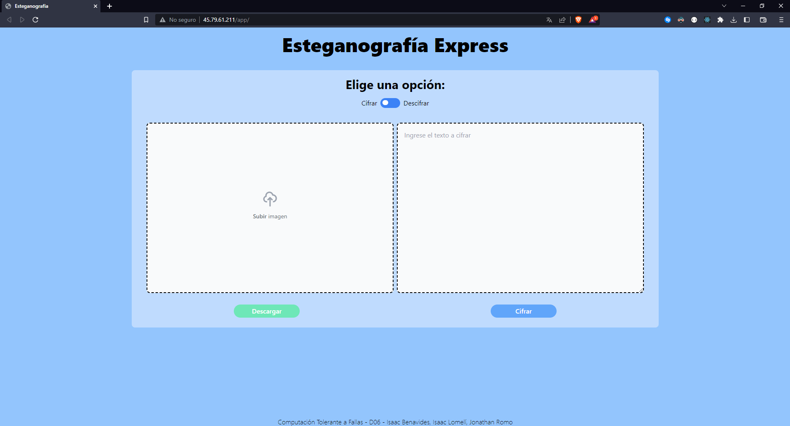
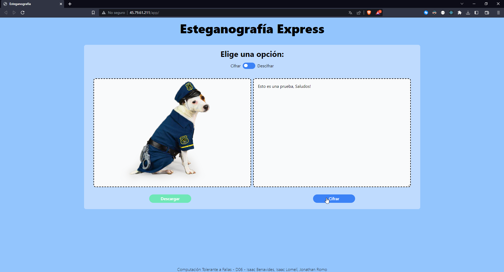
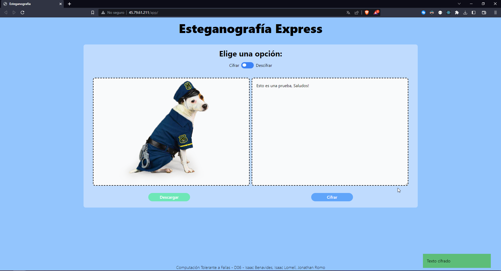
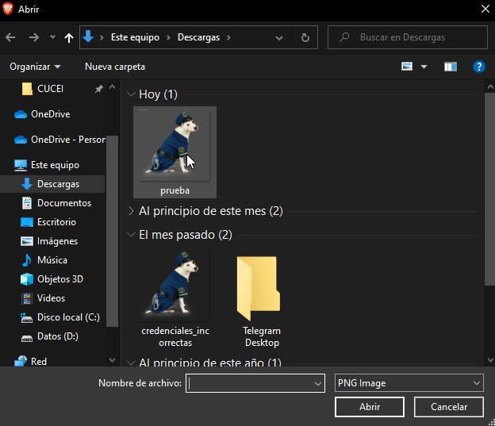
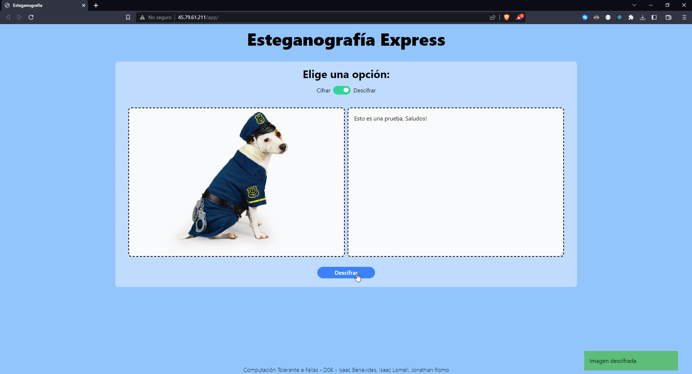
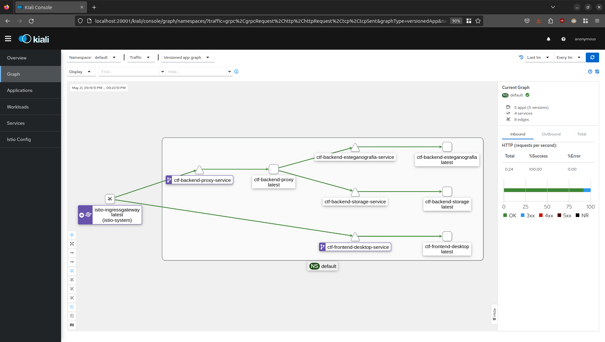
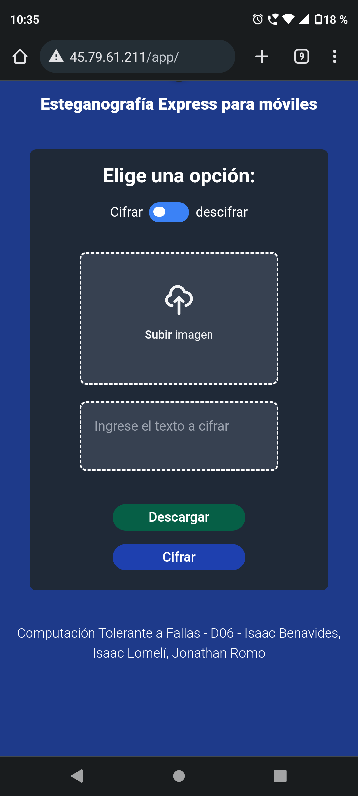

# Computación Tolerante a Fallas - Proyecto Final
## **Universidad de Guadalajara** - Centro Universitario de Ciencias Exactas e Ingenierias

### Este es un proyecto realizado para la materia de Computación Tolerante a Fallas - D06

---
### Alumnos 

- Benavides Hernandez Isaac Alain
- Lomeli Flores Jesus Isaac
- Romo Valadez Jonathan Joshua

---
## Introducción
Las aplicaciones que son construidas dia a dia utilizan miles de herramientas y dependencias para poder ejecutarse, y aunque nosotros como programadores realicemos pruebas exhaustivas a nuestra aplicación, las pruebas denotan la existencia de errores, más no su ausencia, por lo que la capacidad de que nuestra aplicación se recupere de un error inesperado es un gran extra, o incluso necesario en aplicaciones escenciales. Para el proyecto final nosotros desarrollamos una aplicación basada en microservicios, utilizando herramientas que fueron vistas a lo largo del semestre como lo son Docker, Kubernetes e Istio.

---
## Prerequisitos
Para poder ejecutar esta aplicación necesitas tener instalado: 
- Docker.
- Minikube para ambiente local.
- Kubectl para administrar el ambiente en la nube.
- Istioctl
- Python
- Node.js

Adicional a esto, si realizaras el despliegue en la nube necesitaras una cuenta con credito disponible en algun proveedor de servicios de Cloud Computing (AWS, Azure, GCP) nosotros en particular usamos Linode.

---
## Link a la aplicación: http://45.79.61.211/app/

---
## Contenido
Este proyecto consiste en una serie de microservicios montadas en la nube con Kubernetes, utilizando la malla de servicios de Istio para agregar algunas funcionalidades extra a la aplicación, como las metricas y estadisticas de salud, añadimos reglas especiales para que redirija a servicios diferentes dependiendo si un usuario esta en un celular o una computadora, además de que configuramos reintentos si las peticiones a un servicio fallan.

Como primer vistazo a la página, que se puede acceder por medio de la dirección http://45.79.61.211/app/ podemos ver los campos necesarios para utilizar las funcionalidades de la misma. La aplicación, como el título de la página indica, consiste en la esteganografía, que en pocas palabras trata de ocultar información dentro de algo, en este caso una imagen, por lo que los campos son para una imagen, texto a cifrar, un switch para cambiar de cifrar a descifrar o viceversa, un botón para descargar la imagen que se haya obtenido una vez se haya cifrado un texto y un botón para cifrar el texto y obtener la imagen.

En la siguiente imagen se puede ver un ejemplo de cómo se ve la página una vez se hayan ingresado datos. Cómo se indicó anteriormente, se deberá de dar clic al botón de cifrar para poder obtener la imagen con los datos ocultos.

Después de darle clic al botón de cifrar, deberá de aparecer un mensaje indicando si se cifró correctamente el texto, en caso de que sí, se podrá descargar la imagen con el botón Descargar.

Para poder descifrar esa imagen, se deberá de cambiar el switch a Descifrar, y en el campo de la imagen se debe colocar la imagen descargada.

Una vez colocada la imagen, se deberá de dar clic el botón Descifrar y se podrá apreciar el mensaje que ya ha sido descifrado en la parte derecha.

Podremos ver con Kiali cómo se conectan los datos en Istio.

En la siguiente imagen podemos apreciar cómo cambia el estilo entre una versión y otra, en este caso se ve la versión para moviles.

---
## Conclusión
Para finalizar, gracias a este proyecto y a las prácticas que realizamos a lo largo del semestre, nos dimos cuenta que los métodos tradicicionales como el try-catch son buenos, sin embargo, muchas veces esto no es suficiente, una aplicación al nivel industrial debe de garantizar un 99% de disponibilidad mensual, por lo que garantizar que nuestra aplicación cumpla con esto debemos de agregar nuevas técnicas y herramientas para recuperación en caso de fallo, monitorización, resiliencia a fallo, etc. Herramientas como las que vimos y utilizamos nos servirán mucho en nuestra vida laboral, aunque no sepamos manejarla al 100%, nosotros sabemos de su existencia y en qué puede ayudarnos.